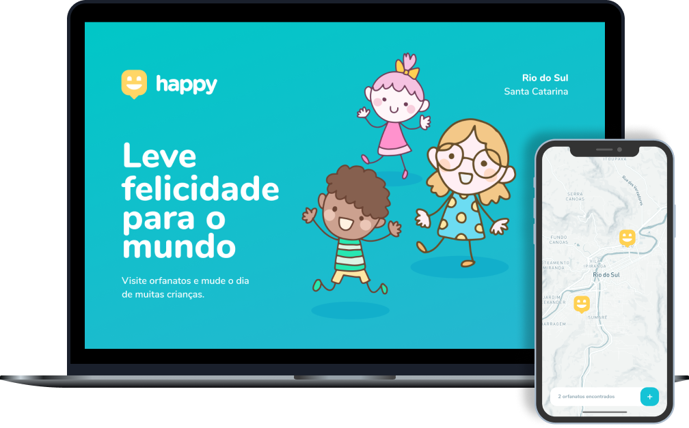

# Happy - Visite orfanatos e mude o dia de muitas crianças

<a id="o_que_e_happy"></a>

## O que é Happy?

Happy é uma plataforma que te ajuda a localizar orfanatos com o auxílio de mapas.

<a id="prototipo"></a>

## Protótipo ([Web](https://www.figma.com/file/JrKEg4UvgDLUE21qWZECYM/Happy-Web) e [Mobile](https://www.figma.com/file/hJMLvYR1J71WnNOlwXmPmi/Happy-Mobile))



## Instalação e uso
- Em "server > src > database" mude o nome do arquivo "database_example.sqlite" para "database.sqlite".
- Execute (para criar o banco e tabelas no sqlite): 
``` 
yarn typeorm migration:run 
```
- Ainda no server, execute (para iniciar o back):
``` 
yarn dev
```
- Com o back ainda executando, acesse a pasta web e mude o nome do arquivo ".env_example" para ".env".
- Dentro do "env", insira seu token [mapbox](https://www.mapbox.com/) no lugar de "seu_token_mapbox".
    - Para criar um token, primeiro crie uma conta no site [mapbox](https://www.mapbox.com/), faça login e na sua [página de usuário](https://account.mapbox.com/) copie a "Default public token". Este é o token que você deve informar no "env".
- Com o back ainda executando, acesse a pasta web e execute (para iniciar o front web):
``` 
yarn start
```